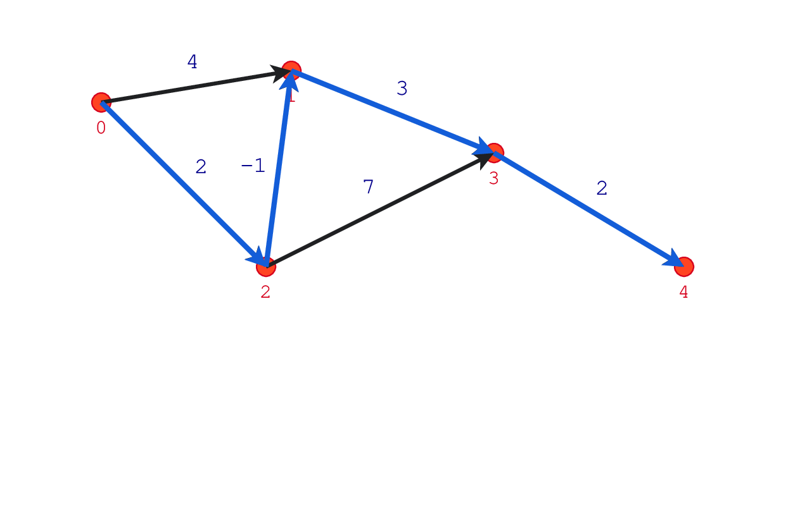

# PathFinding

A small desktop application for building weighted graphs and visualizing shortest paths. The project was created as coursework for a discrete mathematics class.

The interface lets a user create vertices and directed or bidirectional edges, assign integer weights, choose source and destination vertices, and highlight the shortest path found with the Bellman-Ford algorithm.



## Features

- interactive graph construction on a Tkinter canvas;
- directed and bidirectional weighted edges;
- optional grid snapping;
- shortest-path calculation with negative edge weights;
- detection of a negative-weight cycle reachable from the source;
- visual highlighting of the resulting path;
- validation of source and destination vertex indexes.

## How to use

1. Run the application and left-click the canvas to create or select vertices.
2. Select two different vertices to connect them.
3. Choose `A to B arc` or `Edge` in the `Switch Direction` menu before creating a connection.
4. Right-click an edge, or select it in the list on the right, to assign its weight.
5. Select `Find Shortest Path` and enter two vertex indexes separated by a space, for example `0 4`.
6. The application highlights the path and displays its total weight.

## Algorithm

The graph is represented as an edge list. Bellman-Ford relaxes every edge up to `V - 1` times and then performs one additional pass to detect a reachable negative-weight cycle. Its time complexity is `O(VE)` and its auxiliary space complexity is `O(V)`.

If the destination is unreachable, the application reports that no path exists. If a reachable negative-weight cycle is detected, no finite shortest path is returned.

## Requirements and launch

- Python 3.8 or newer;
- Tkinter, normally included with standard Python desktop installations.

```bash
python3 main.py
```

No third-party Python packages are required.

## Tests

Run the standard-library unit tests from the repository root:

```bash
python3 -m unittest discover -s tests -v
```

The suite covers ordinary and negative-weight paths, unreachable destinations, negative cycles, identical source and destination vertices, and invalid input indexes.

## Project structure

- `Graph.py` contains the Bellman-Ford implementation.
- `App.py` coordinates user input, graph construction, and result display.
- `Cells.py` renders vertices, edges, weights, and selected paths.
- `graph_elements/` contains the vertex and edge domain objects.
- `tests/` contains unit tests for graph behavior and input validation.
